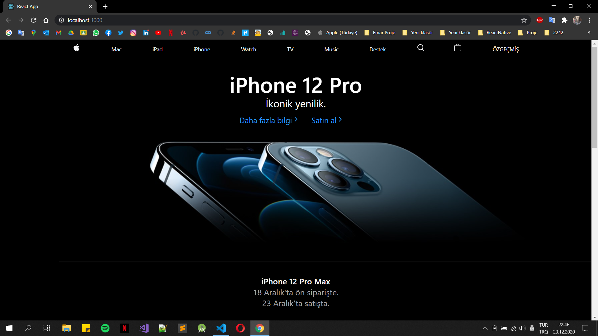
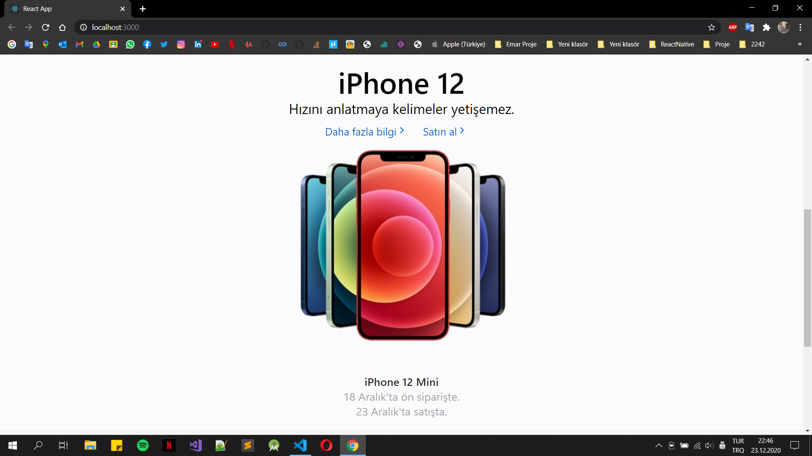
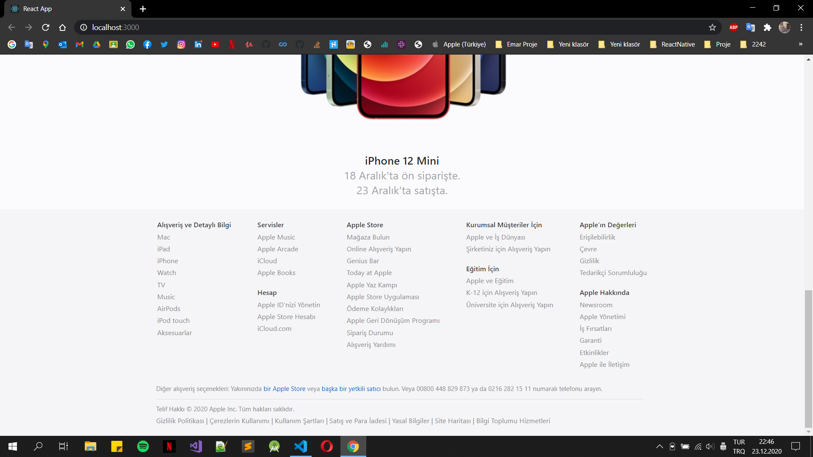
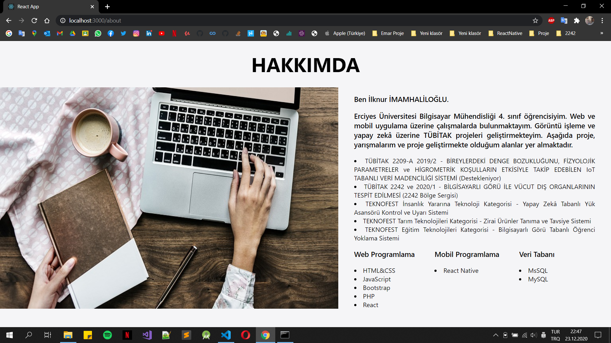

# https://www.apple.com/tr/ sitesinin frontend birebir yeniden tasarımı 
## BS435 Web Programlama 1 Dersi Vize Ödevi
### Erciyes Üniversitesi Bilgisayar Mühendisliği Bölümü  

Tasarlayan: İlknur İMAMHALİLOĞLU

# Dosyalar

-------------------------------------------------------------------

-------------------------------------------------------------------

-------------------------------------------------------------------

-------------------------------------------------------------------

# Kullanılan Araçlar

 1. HTML5
 2. CSS3
 3. Bootstrap
 4. React

# Kullanılan Yazılımlar

 1. VSCode

# Kullanılan Kütüphaneler

 1. react
 2. react-dom
 3. react-bootstrap
 4. bootstrap
 5. react-navigation

